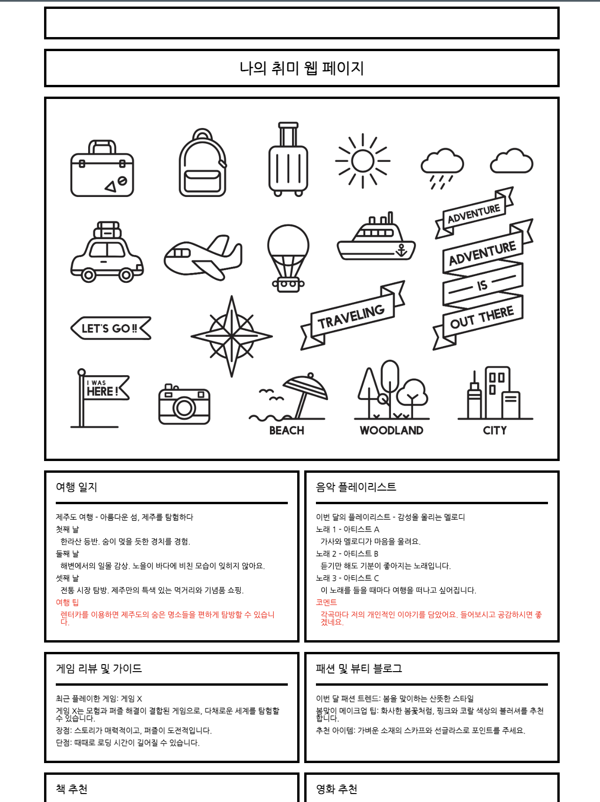

# 개인 취미 웹 페이지 프로젝트 - CSS편

  

이 프로젝트는 HTML 기초에 이어 CSS를 기초적인 내용을 다루며, 웹 페이지의 스타일과 레이아웃을 개선하는 방법을 배웁니다. 참여자는 CSS를 활용하여 개인의 취미와 관심사를 돋보이게 표현하는 웹 사이트를 만드는 기술을 습득합니다.

## 프로젝트 목표

- **CSS 기초**: CSS의 기본적인 기술을 배워보며, 웹 페이지의 미적 요소와 사용자 경험을 향상시킵니다.
- **스타일링과 시각적 창의력 개발**: CSS를 활용하여 개성 있는 웹 디자인을 구현합니다.
- **균형적인 UI 설계**: 각 웹 페이지 섹션을 깔끔하고 정갈하게 표현하는 방법을 배워, 사용자에게 명확하고 편안한 뷰를 제공합니다.

## 프로젝트 구성

- **여행 일지**: 여행 경험과 팁을 기록하고 공유하는 섹션입니다.
- **음악 플레이리스트**: 개인적으로 좋아하는 음악을 리스트업하여 공유합니다.
- **게임 리뷰 및 가이드**: 최근 플레이한 게임에 대한 리뷰와 플레이 가이드를 제공합니다.
- **패션 및 뷰티 블로그**: 패션과 뷰티에 대한 팁과 트렌드를 공유합니다.
- **책 추천**: 영감을 주는 책들을 추천합니다.
- **영화 추천**: 볼 가치가 있는 영화들을 소개합니다.

## 프로젝트 코드 리뷰

#### HTML 구조

**DOCTYPE 및 언어 설정:** HTML5 문서를 정의하며, lang="ko"로 설정하여 한국어 페이지임을 명시합니다.  
**메타 및 타이틀 설정:** 문자 인코딩을 UTF-8로 설정하고, 페이지의 제목을 `<title>` 태그를 사용해 "나의 취미 웹 페이지"로 정합니다.  
**스타일 및 폰트 링크:** CSS 초기화를 위한 reset.css, Google Fonts로부터 'Nanum Gothic' 폰트를 사용합니다. 

#### CSS 스타일링

**body 스타일:** display: flex; justify-content: center; background-color: #fff를 통해 페이지의 메인 콘텐츠를 화면 중앙에 정렬하고, 배경색을 흰색으로 설정합니다.  
**콘텐츠 컨테이너 스타일:** margin: 10px; max-width: 1100px; width: 1100px로 최대 너비를 설정하여, 모든 주요 콘텐츠가 이 너비 내에 위치하도록 합니다. 
**각 섹션 스타일링:** text-align: center; padding: 20px; border: 5px solid black; margin-top: 20px 등을 통해 각 섹션의 내용을 중앙 정렬하고, 패딩 및 마진을 통해 공간을 조정합니다. 

#### 섹션 별 구조

**헤더 및 이미지:** 각 섹션의 시작은 헤더(h1, h2)로 구분하고, 이미지는 `` 태그를 사용하여 표시합니다.  
**리스트 및 텍스트:** 콘텐츠는 `<ul>`과 `<li>`를 사용해 목록으로 구성되며, 텍스트는 `
` 태그로 포함됩니다. 각 텍스트는 font-weight: bold; color: red 등의 스타일로 강조됩니다. 

#### 인라인 CSS의 장단점

**장점:** HTML 파일 하나로 웹 페이지 전체의 스타일과 콘텐츠를 관리할 수 있어, 간단한 프로젝트나 빠른 프로토타입에 적합합니다.
**단점:** 스타일이 HTML과 섞여 있어 유지보수가 어렵고, 스타일 변경 시 여러 부분을 수정해야 할 수 있습니다. 또한, 페이지 로딩 속도가 느려질 수 있습니다.

## 결론

이 프로젝트를 통해 우리는 CSS를 활용하여 사용자에게 시각적으로 매력적이고 기능적인 웹 인터페이스를 제공하는 디자인 원리를 이해하게 되었습니다. 색상, 레이아웃, 글꼴, 이미지 사용을 적절히 조합하고 조정함으로써 사용자의 시각적 경험을 향상시키고 웹 사이트의 전반적인 매력을 증가시킬 수 있었습니다. 이 과정을 통해 우리는 웹 개발에 있어 기본적이면서도 필수적인 디자인 기술들을 실제적으로 적용해볼 수 있었으며, 이를 통해 개인적인 취미나 관심사를 효과적으로 표현하는 웹 페이지를 만들 수 있게 되었습니다. 이러한 경험은 향후 다양한 웹 프로젝트를 수행함에 있어 기술적 자신감을 높이고, 창의적인 사고와 문제 해결 능력을 발전시키는 데 큰 도움이 될 것입니다.

감사합니다, 그리고 다음 시간에 뵙겠습니다. 😃😃
